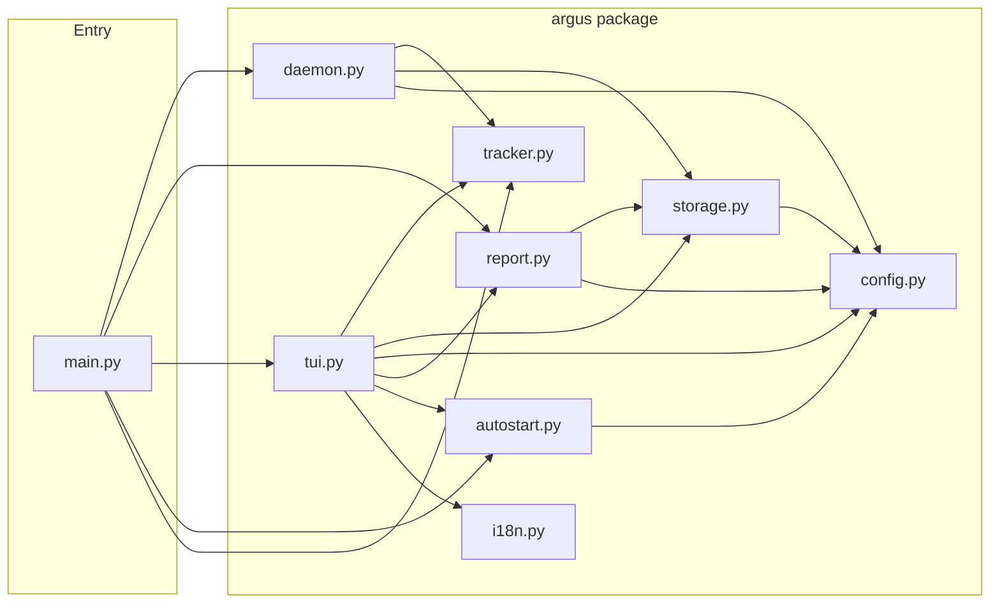

# Argus

**README の言語：** [English](README.md) · 日本語 · [中文](README.zh.md)

> *ギリシャ神話の百眼の巨人アルゴス・パノプテスにちなんで命名。眠らず、すべてを見守り続けた。*

> *シンプルな問いから始まった6ヶ月のソロプロジェクト：私の時間は何処へ向かっているのか？*

## Screenshots

スクリーンショットは [English README](README.md#screenshots) を参照してください。

---

## 設計の視点

```
要件定義 → システム基本設計 → システム詳細設計
```

---

### 要件定義

**機能要件** — システムが做什么。

| # | 要件 | 目標 |
|---|---|---|
| R1 | フォアグラウンドウィンドウを追跡 | 5 秒間隔で静かに記録 |
| R2 | アプリを自動分類 | 11 の組み込みカテゴリ |
| R3 | スナップショットを SQLite に保存 | シンプル、移植性、ゼロ設定、サーバー不要 |
| R4 | TUI プロセス内にトラッカーを内包 | `argus tui` 一発で起動、バックグラウンドサービス不要 |
| R5 | ログイン時に自動起動 | OS 別の登録 |
| R6 | 多言語対応 TUI | 6 言語、設定に保存 |
| R7 | 12 色のテーマ | `T` で切り替え |

**非機能要件** — システムがどの程度 잘 하는지。

| # | 要件 | 目標 |
|---|---|---|
| R8 | プライバシー | 全データローカル保存 — ネットワーク・テレメトリなし |
| R9 | クロスプラットフォーム | Windows、macOS、Linux |
| R10 | 軽量 | 典型デスクトップで CPU 1% 未満 |
| R11 | アイドル検出 | ユーザーが離れている間のスナップショットをスキップ |
| R12 | 低ストレージオーバーヘッド | 5 秒間隔で 1 行 |
| R13 | モジュラー / 拡張可能 | 明確なレイヤー分離 |

> **機能表** — 各要件は機能（F1–F7）または品質属性（NF1–NF6）にマップされています。下部の付録を参照してください。

---

### システム基本設計

**三層アーキテクチャ：**

```
┌──────────────────────────────────────────────┐
│  UI 層: TUI (Textual) + レポート (Rich)      │
├──────────────────────────────────────────────┤
│  サービス層: トラッカー、ストレージ、レポート  │
├──────────────────────────────────────────────┤
│  プラットフォーム層: Win32 / macOS / Linux   │
└──────────────────────────────────────────────┘
```

**プロジェクト構成：**

```
src/
├── main.py               # Typer CLI エントリポイント、argus/ に委譲
└── argus/
    ├── __init__.py       # パッケージバージョン
    ├── config.py         # 定数・カテゴリマップ・設定永続化
    ├── i18n.py           # UI 文字列カタログ（6 言語）
    ├── tracker.py        # アクティブウィンドウ + アイドル検出（Win / macOS / Linux）
    ├── storage.py        # SQLite 読み書き
    ├── daemon.py         # フォアグラウンドポーリングループ（`start` コマンド）
    ├── report.py         # Rich 日次 / 週次 / ステータスレポート
    ├── tui.py            # Textual リアルタイムダッシュボード
    └── autostart.py      # 自動起動ヘルパー（Win / macOS / Linux）
build.py                  # PyInstaller ビルドスクリプト → dist/argus[.exe]
requirements.txt          # ランタイム依存関係
requirements-dev.txt     # ランタイム + ビルドツール（pyinstaller）
dist/                    # コンパイル済み実行ファイル（.gitignore 済み）
```

**技術スタック：**

| concern | ツール |
|---|---|
| アクティブウィンドウ検出 | `pywin32`（Windows）· `osascript`（macOS）· `xdotool`（Linux）|
| アイドル検出 | `GetLastInputInfo` via ctypes（Windows）· `ioreg`（macOS）· `xprintidle`（Linux）|
| プロセス情報 | `psutil` |
| ストレージ | SQLite（標準ライブラリ `sqlite3`）|
| CLI | `Typer` |
| ターミナルレポート | `Rich` |
| インタラクティブダッシュボード | `Textual` |
| 自動起動 | レジストリキー（Windows）· LaunchAgent plist（macOS）· XDG autostart（Linux）|

**アプリのカテゴリ：**

`ブラウザ` · `IDE / エディタ` · `ターミナル` · `コミュニケーション` · `デザイン` · `ゲーム` · `生産性` · `メディア` · `ファイルマネージャー` · `システム` · `その他`

マッピングを変更するには `argus/config.py` の `CATEGORIES` を編集してください。

**アーキテクチャ図**（[Mermaid](https://mermaid.js.org/) — GitHub で自動描画）：

*モジュール構造 — `main.py` が各 `argus/` モジュールに委譲：*



*アクティビティ — トラッキングループ（`start` と TUI バックグラウンドポーラーで共有）：*


---

### システム詳細設計

**データスキーマ** — `~/.argus/argus.db` に 5 秒ごとのスナップショットが 1 行（パスは `ARGUS_DATA` 環境変数で変更可）：

| カラム | 型 | 説明 |
|---|---|---|
| `ts` | REAL | Unix タイムスタンプ |
| `app_name` | TEXT | プロセス名（例：`chrome`、`code`）|
| `window_title` | TEXT | その時点のウィンドウタイトル |
| `exe_path` | TEXT | 実行ファイルのフルパス |
| `idle` | INTEGER | アイドルしきい値を超えた場合 1 |

アイドルのスナップショットはレポートと TUI でデフォルト除外されます。ユーザー設定（言語、テーマ）は `~/.argus/settings.json` に別途保存されます。

**設定定数** `argus/config.py` 内：

```python
POLL_INTERVAL  = 5    # スナップショットの間隔（秒）
IDLE_THRESHOLD  = 60   # アイドルとみなす無操作時間（秒）
```

**TUI — キーボードショートカット：**

| キー | 動作 |
|---|
| `R` | 全データを今すぐ更新 |
| `T` | カラーテーマを切り替え |
| `L` | 表示言語を切り替え（6 言語）|
| `A` | 自動起動の切り替え |
| `O` | データフォルダを開く |
| `[` `]` | 前日 / 翌日 |
| `{` `}` | 前週 / 翌週 |
| `Q` | 終了 |

`argus tui` を実行すると [Textual](https://textual.textualize.io/) による全画面リアルタイムダッシュボードが開きます。トラッカーもバックグラウンドで同時起動するため、別途 `start` は不要です。

**表示内容**

- **ステータスパネル** — アクティブなアプリ・カテゴリ・ウィンドウタイトル・アイドル時間・スナップショット総数
- **今日** — 上位 10 アプリとカテゴリ内訳（プログレスバー付き）
- **今週** — 日別サマリー・週次カテゴリ分布・週次上位アプリ

5 秒ごとに自動更新されます。

TUI は 6 言語に対応しており、`L` で順番に切り替えられます：

`en` (English) · `ja` (日本語) · `zh` (中文) · `fr` (Français) · `de` (Deutsch) · `es` (Español)

言語の選択は `~/.argus/settings.json` に保存され、次回起動時に復元されます。

TUI で `T` を押すと 12 種類の内蔵 Textual テーマを順番に切り替えられます：

`textual-dark` · `textual-light` · `nord` · `gruvbox` · `catppuccin-mocha` · `catppuccin-latte` · `dracula` · `tokyo-night` · `monokai` · `solarized-dark` · `solarized-light` · `flexoki`

テーマの選択も自動的に保存・復元されます。

---

## Origin Story — 開発のきっかけ

半年前のことでした。

僕はちょうど —— フルタイムの仕事、フリーランスの案件、勉学 —— という過密な時期を終えたばかりでした。ある夜、自分にシンプルな問いを投げかけました：**自分の時間は何処へ向かっているのか？**

記憶しようとした。试を開いてみた。うまくいかない。問題は努力ではなかった —— 見えないことこそが问题だった。改善しようにも測定できなければ、コンピュータでの作業時間を後から振り返ることはできない。

そこで Argus を作りました。

タスク管理ツールでも、ポモドーロタイマーでもありません。**受動的で、常時稼働する鏡**として、自分のしていることをただ記録し、後から真実を見られるようにしました。5秒ごとに、プロンプトなし、摩擦なしで。

### なぜ自作したのか？

既存のツールを検討しました：RescueTime、ActivityWatch、Toggl。どれも不错的ですが、それぞれに僕が求めたくないものがありました：

- クラウド依存 —— すべてのウィンドウ活動をサーバーに送るのが気が進まなかった
- サブスクリプション料金 —— 永久に動かし続けたいものに
- Linuxのギャップ —— 大半が一流サポートを提供していなかった
- TUIがない —— 僕はターミナルで暮らしている

Argusは僕が欲しいと思ったツールです：**ローカル専用、クロスプラットフォーム、ゼロコスト、ターミナルネイティブ。** Windows、macOS、Linuxのいずれでもバックグラウンドで静かに動きます。データは決してあなたの機械から離れず、TUIダッシュボードはTextualで駆動され、リアルタイムで更新されます。週次レポートは今否则気づかないパターンを浮かび上がらせます。

### 開発から学んだこと

过半年のソロ開発は予期しない教训をもたらしました：**制約こそが機能だった。** 早朝や週末の隙間時間を 利用してArgusを構築神之，所以过酷な设计はできませんでした。すべての决定に正当化が必要。シンプルさは妥协ではなく哲学になりました。

结果是。每天使うようになりました。そして今、OSSです。

> 自分の時間が何処へ向かっているのか気になったことがあるなら —— [試してみてください](https://github.com/boycececil666/t1-pub-argus)。

---

## Quickstart

### Windows

```bash
# Download dist/argus.exe and run
argus.exe tui
```

### macOS

```bash
# Download dist/argus and run
./argus tui
```

### Linux

```bash
# Install system dependencies first
sudo apt install xdotool xprintidle   # Ubuntu / Debian
sudo dnf install xdotool xprintidle   # Fedora

# Download dist/argus and run
./argus tui
```

### 次にやること

```bash
# View today's activity report
argus tui        # Interactive dashboard (recommended)
argus report     # Text report in terminal

# View specific day
argus report --date 2026-04-05

# View this week's report
argus week

# Check what you're doing right now
argus status

# Auto-start on login
argus install    # Enable auto-start
argus uninstall  # Disable auto-start
```

---

## 付録 — 機能リファレンス

上の**要件定義**の各要件は、**機能**（F1–F7）または**品質属性**（NF1–NF6）にマップされています。

**機能的機能：**

| # | 機能 | 根拠 |
|---|---|---|
| F1 | フォアグラウンドウィンドウを追跡 | コアバリュー — 常駐、静音、バックグラウンド |
| F2 | アプリを自動分類 | 生プロセス名を意味あるカテゴリに変換 |
| F3 | スナップショットを SQLite に保存 | シンプル、移植性、ゼロ設定、サーバー不要 |
| F4 | TUI プロセス内にトラッカーを内包 | `argus tui` 一発で起動、バックグラウンドサービス不要 |
| F5 | ログイン時に自動起動 | ユーザー行動ゼロで記録開始 |
| F6 | 多言語対応 TUI（6 言語）| 非英語話者へのアクセシビリティ |
| F7 | 12 色のテーマ | コード変更なしでパーソナライズ |

**非機能的品質属性：**

| # | 品質 | 駆動要因 |
|---|---|---|
| NF1 | プライバシー — 全データローカル保存 | ユーザー信頼 |
| NF2 | クロスプラットフォーム可用性 | プラットフォーム多様性 |
| NF3 | 軽量なパフォーマンス | 常駐制約 |
| NF4 | アイドル検出 | データ品質 |
| NF5 | 低ストレージオーバーヘッド | 長期運用可能性 |
| NF6 | モジュラー / 拡張可能 | 将来の設計変更 |
