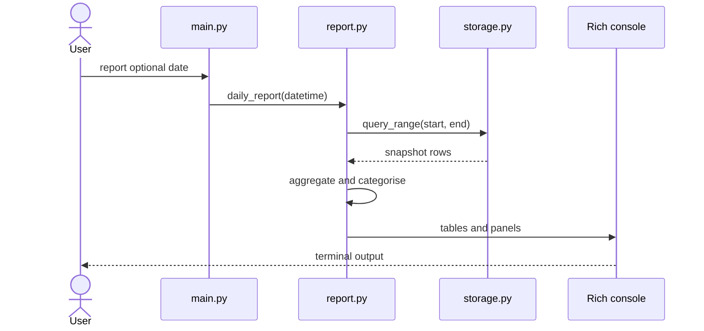
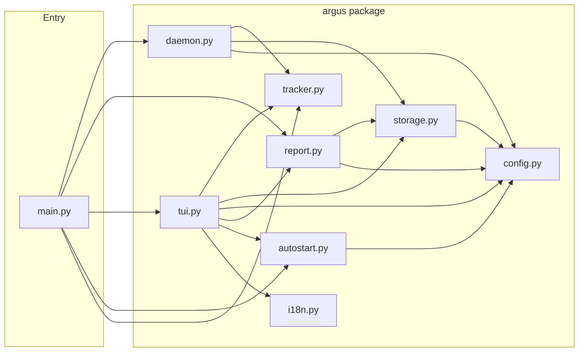
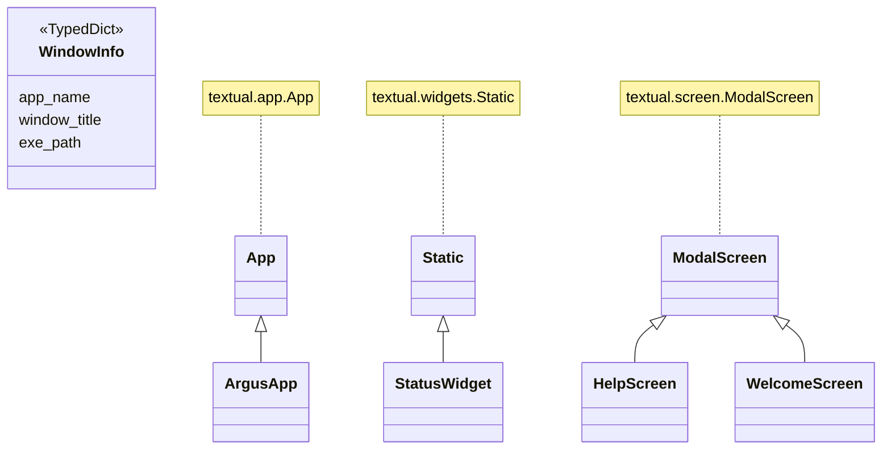
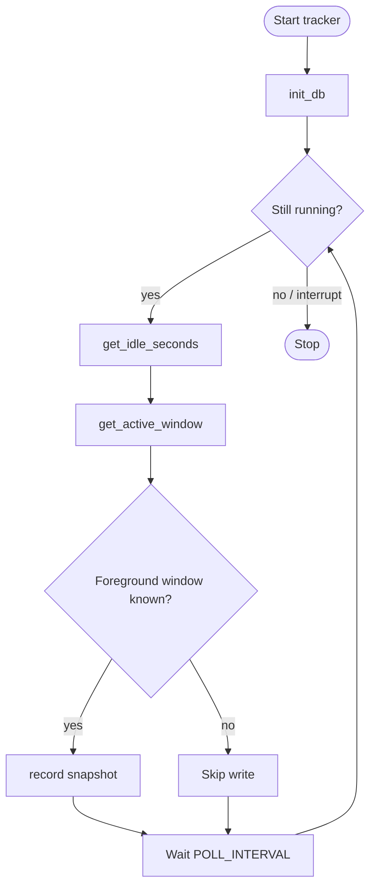

# Argus

**README の言語：** [English](README.md) · 日本語 · [中文](README.zh.md)

> *ギリシャ神話の百眼の巨人アルゴス・パノプテスにちなんで命名。眠らず、すべてを見守り続けた。*

5 秒ごとにアクティブなアプリとウィンドウを静かに記録する Python ツールです。バックグラウンドで動かしながら、ライブダッシュボードやターミナルレポートで自分の時間の使い方を把握できます。

## Screenshots

スクリーンショットは [English README](README.md#screenshots) を参照してください。

---

## Architecture diagrams

The following [Mermaid](https://mermaid.js.org/) blocks render natively on GitHub. They document the module structure, key types, the tracking polling loop, and the `report` command call sequence.

### Sequence diagram — `report`



### Module structure

High-level dependency flow: `main.py` delegates to each `argus/` module.



### Class diagram

`WindowInfo` is the TypedDict snapshot shape returned by the tracker; TUI screens subclass Textual widgets.



### Activity diagram — tracking loop

Shared logic for the `start` / daemon and the TUI background poller: poll interval → idle check → record snapshot → wait → repeat.



---

## 技術スタック

| 機能 | ツール |
|---|---|
| アクティブウィンドウ検出 | `pywin32`（Windows）· `osascript`（macOS）· `xdotool`（Linux）|
| アイドル検出 | `GetLastInputInfo` via ctypes（Windows）· `ioreg`（macOS）· `xprintidle`（Linux）|
| プロセス情報 | `psutil` |
| ストレージ | SQLite（標準ライブラリ `sqlite3`）|
| CLI | `Typer` |
| ターミナルレポート | `Rich` |
| インタラクティブダッシュボード | `Textual` |
| 自動起動 | レジストリキー（Windows）· LaunchAgent plist（macOS）· XDG autostart（Linux）|

---

## 開発環境のセットアップ

```bash
pip install -r requirements.txt
```

**Linux のみ** — ウィンドウ・アイドル検出に必要なシステムパッケージ：
```bash
sudo apt install xdotool xprintidle   # Ubuntu / Debian
sudo dnf install xdotool xprintidle   # Fedora
```

---

## スタンドアロン実行ファイルのビルド

Python や pip を一切インストールせずに使える単一ファイルにパッケージングします。

```bash
# ビルドツールのインストール（初回のみ）
pip install -r requirements-dev.txt

# ビルド
python build.py
```

出力は `dist/` ディレクトリに：

| プラットフォーム | ファイル |
|---|---|
| Windows | `dist/argus.exe` |
| Linux | `dist/argus` |
| macOS | `dist/argus` |

実行ファイルは完全に自己完結しています。Python・Textual・Rich などすべての依存関係を内包。**ユーザーは何もインストール不要です。**

> **Linux の注意：** `xdotool` と `xprintidle` はシステムパッケージのためバンドルできません。Linux 版を配布する際は以下を案内してください：
> ```bash
> sudo apt install xdotool xprintidle
> ```

---

## 使い方（ソースから実行）

```bash
# インタラクティブダッシュボード（推奨——バックグラウンドでトラッカーも起動）
python src/main.py tui

# トラッカーのみフォアグラウンドで起動（Ctrl+C で停止）
python src/main.py start

# 今日のアクティビティレポート
python src/main.py report

# 指定日のレポート
python src/main.py report --date 2026-03-15

# 今週のレポート
python src/main.py week

# 今何をしているか確認
python src/main.py status

# ログイン時の自動起動を登録
python src/main.py install

# 自動起動の登録解除
python src/main.py uninstall
```

### ビルド済み実行ファイルの使い方

```bash
argus tui
argus report
argus install
# 同じコマンド — "python src/main.py" プレフィックス不要
```

---

## TUI ダッシュボード

`argus tui` を実行すると [Textual](https://textual.textualize.io/) による全画面リアルタイムダッシュボードが開きます。トラッカーもバックグラウンドで同時起動するため、別途 `start` は不要です。

**表示内容**

- **ステータスパネル** — アクティブなアプリ・カテゴリ・ウィンドウタイトル・アイドル時間・スナップショット総数
- **今日** — 上位 10 アプリとカテゴリ内訳（プログレスバー付き）。◀ ▶ と「今日」で別の日へ
- **今週** — 日別サマリー・週次カテゴリ分布・週次上位アプリ。◀ ▶ と「今週」で別の週へ

5 秒ごとに自動更新されます。「今日」「今週」表示中は実カレンダーに追従（日付変更後も今日・今週のまま）。

**キーボードショートカット**

| キー | 動作 |
|---|---|
| `?` | ヘルプ画面 |
| `R` | 全データを今すぐ更新 |
| `T` | カラーテーマを切り替え |
| `L` | 表示言語を切り替え |
| `A` | 自動起動の切り替え（有効 / 無効）|
| `O` | データフォルダをファイルマネージャーで開く |
| `[` `]` | 前日 / 翌日（ダッシュボード履歴） |
| `{` `}` | 前週 / 翌週（ダッシュボード履歴） |
| `Q` | 終了 |

**ツールバーボタン**

| ボタン | 動作 |
|---|---|
| `自動起動  ON/OFF` | ログイン自動起動の切り替え |
| `JA  日本語` | 言語の切り替え |
| `DBフォルダを開く` | データフォルダを開く |

---

## 言語サポート

TUI は 6 言語に対応しており、`L` で順番に切り替えられます：

| コード | 言語 |
|---|---|
| `en` | English |
| `ja` | 日本語 |
| `zh` | 中文 |
| `fr` | Français |
| `de` | Deutsch |
| `es` | Español |

言語の選択は `~/.argus/settings.json` に保存され、次回起動時に復元されます。

---

## テーマ

TUI で `T` を押すと 12 種類の内蔵 Textual テーマを順番に切り替えられます（追加インストール不要）：

`textual-dark` · `textual-light` · `nord` · `gruvbox` · `catppuccin-mocha` · `catppuccin-latte` · `dracula` · `tokyo-night` · `monokai` · `solarized-dark` · `solarized-light` · `flexoki`

テーマの選択も自動的に保存・復元されます。

---

## データ

すべてのデータは `~/.argus/argus.db`（SQLite）に保存されます（フォルダは環境変数 `ARGUS_DATA` で変更可）。5 秒ごとのスナップショットが 1 行：

| カラム | 型 | 説明 |
|---|---|---|
| `ts` | REAL | Unix タイムスタンプ |
| `app_name` | TEXT | プロセス名（例：`chrome`、`code`）|
| `window_title` | TEXT | その時点のウィンドウタイトル |
| `exe_path` | TEXT | 実行ファイルのフルパス |
| `idle` | INTEGER | アイドルしきい値を超えた場合 1 |

アイドルのスナップショットはレポートと TUI でデフォルト除外されます。

ユーザー設定（言語・テーマ）は `~/.argus/settings.json` に別途保存されます。

---

## カテゴリ

アプリは自動的に以下のカテゴリに分類されます：

`ブラウザ` · `IDE / エディタ` · `ターミナル` · `コミュニケーション` · `デザイン` · `ゲーム` · `生産性` · `メディア` · `ファイルマネージャー` · `システム` · `その他`

マッピングを変更するには `src/argus/config.py` の `CATEGORIES` 辞書を編集してください。

---

## 設定調整

`src/argus/config.py` 上部の 2 つの定数を編集：

```python
POLL_INTERVAL  = 5    # スナップショットの間隔（秒）
IDLE_THRESHOLD = 60   # アイドルとみなす無操作時間（秒）
```

---

## プロジェクト構成

```
src/
├── main.py               # Typer CLI エントリポイント
└── argus/
    ├── __init__.py       # パッケージバージョン
    ├── config.py         # 定数・カテゴリマップ・設定永続化
    ├── i18n.py           # UI 文字列カタログ（6 言語）
    ├── tracker.py        # アクティブウィンドウ + アイドル検出
    ├── storage.py        # SQLite 読み書き
    ├── daemon.py         # フォアグラウンドポーリングループ
    ├── report.py         # Rich 日次 / 週次 / ステータスレポート
    ├── tui.py            # Textual リアルタイムダッシュボード
    └── autostart.py      # 自動起動ヘルパー（Win / macOS / Linux）
build.py                  # PyInstaller ビルドスクリプト → dist/argus[.exe]
requirements.txt          # ランタイム依存関係
requirements-dev.txt      # ランタイム + ビルドツール（pyinstaller）
dist/                     # コンパイル済み実行ファイル（.gitignore 済み）
```
