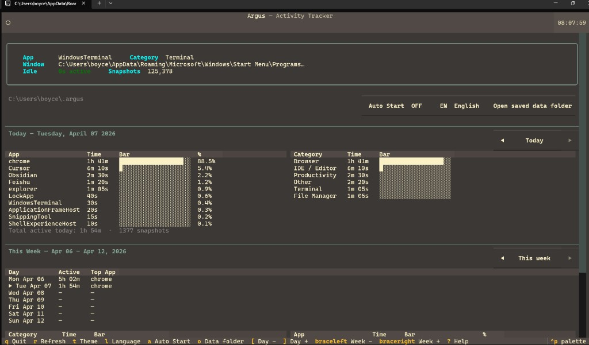
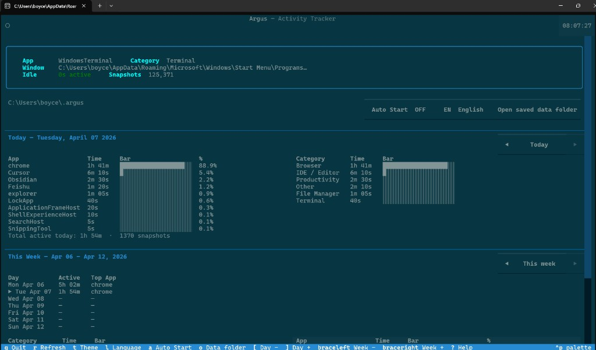
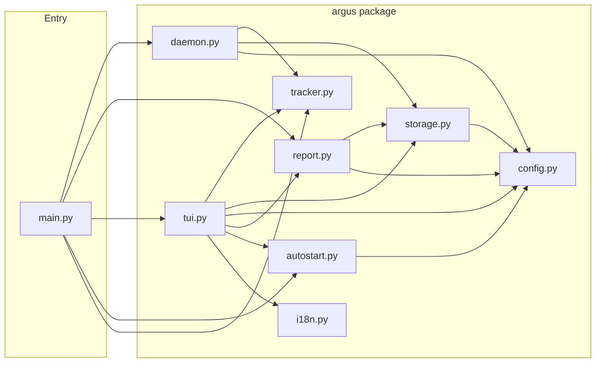

# Argus

**README languages:** English · [日本語](README.ja.md) · [中文](README.zh.md)

> *Named after Argus Panoptes — the hundred-eyed giant of Greek mythology who never slept and watched everything.*

> *A six-month solo project born from a simple question: where does my time actually go?*

A Python tool that silently records which app and window you have active every 5 seconds. Run it in the background, then pull up a live dashboard or a rich terminal report to see exactly where your time goes.

## Screenshots

Live **TUI** on Windows (`argus tui`): status strip, today's app and category breakdown with bars, and the weekly table. Left: **Gruvbox**; right: another built-in dark theme (teal palette). Press `T` to cycle themes.






---

## Design rationale

```
Requirements Definition → Basic System Design → Detailed System Design
```

---

### Requirements Definition

**Functional requirements** — what the system does.

| # | Requirement | Target |
|---|---|---|
| R1 | Track foreground window | Every 5 seconds, silently |
| R2 | Auto-categorise apps | 11 built-in categories |
| R3 | Store snapshots in SQLite | Simple, portable, zero-config, no server |
| R4 | Run tracker inside TUI process | Single `argus tui` starts everything, no separate daemon |
| R5 | Auto-start on login | OS-specific registration |
| R6 | Multi-language TUI | 6 languages, saved to settings |
| R7 | 12 colour themes | Press `T` to cycle |

**Non-functional requirements** — how well the system behaves.

| # | Requirement | Target |
|---|---|---|
| R8 | Privacy | All data stays local — no network, no telemetry |
| R9 | Cross-platform | Windows, macOS, Linux |
| R10 | Lightweight | < 1 % CPU on typical desktop hardware |
| R11 | Idle detection | Skip snapshots when user is away |
| R12 | Low storage overhead | One row per 5-second snapshot |
| R13 | Modular / extensible | Clear layer separation |

> **Feature table** — each requirement maps to a feature (F1–F7) or quality attribute (NF1–NF6). See the appendix at the bottom of this README.

---

### Basic System Design

**Three-layer architecture:**

```
┌─────────────────────────────────────────────┐
│  UI layer: TUI (Textual) + Reports (Rich)  │
├─────────────────────────────────────────────┤
│  Service layer: Tracker, Storage, Report    │
├─────────────────────────────────────────────┤
│  Platform layer: Win32 / macOS / Linux     │
└─────────────────────────────────────────────┘
```

**Project structure:**

```
src/
├── main.py               # Typer CLI — thin entry point, delegates to argus/
└── argus/
    ├── __init__.py       # package version
    ├── config.py         # constants, category map, settings persistence
    ├── i18n.py           # UI string catalogue (6 languages)
    ├── tracker.py        # active window + idle detection (Win / macOS / Linux)
    ├── storage.py        # SQLite read/write
    ├── daemon.py         # foreground polling loop (used by `start` command)
    ├── report.py         # Rich daily/weekly/status reports
    ├── tui.py            # Textual live dashboard
    └── autostart.py      # login auto-start helpers (Win / macOS / Linux)
build.py                  # PyInstaller build script → dist/argus[.exe]
requirements.txt          # runtime dependencies
requirements-dev.txt      # runtime + build tools (pyinstaller)
dist/                     # compiled executables (git-ignored)
```

**Tech stack:**

| Concern | Tool |
|---|---|
| Active window detection | `pywin32` (Windows) · `osascript` (macOS) · `xdotool` (Linux) |
| Idle detection | `GetLastInputInfo` via ctypes (Windows) · `ioreg` (macOS) · `xprintidle` (Linux) |
| Process info | `psutil` |
| Storage | SQLite via stdlib `sqlite3` |
| CLI | `Typer` |
| Terminal reports | `Rich` |
| Interactive dashboard | `Textual` |
| Auto-start | Registry key (Windows) · LaunchAgent plist (macOS) · XDG autostart (Linux) |

**App categories:**

`Browser` · `IDE / Editor` · `Terminal` · `Communication` · `Design` · `Gaming` · `Productivity` · `Media` · `File Manager` · `System` · `Other`

Edit `CATEGORIES` in `argus/config.py` to add or change mappings.

**Architecture diagrams** (rendered via [Mermaid](https://mermaid.js.org/) on GitHub):

*Module structure — `main.py` delegates to each `argus/` module:*



*Activity — tracking loop (shared by `start` and TUI background poller):*


---

### Detailed System Design

**Data schema** — one row per 5-second snapshot in `~/.argus/argus.db` (override path with `ARGUS_DATA`):

| Column | Type | Description |
|---|---|---|
| `ts` | REAL | Unix timestamp |
| `app_name` | TEXT | Process name (e.g. `chrome`, `code`) |
| `window_title` | TEXT | Window title at that moment |
| `exe_path` | TEXT | Full path to the executable |
| `idle` | INTEGER | 1 if no input for longer than the idle threshold |

Idle snapshots are excluded from reports and the TUI by default. User preferences (language, theme) are stored separately in `~/.argus/settings.json`.

**Tuning constants** in `argus/config.py`:

```python
POLL_INTERVAL  = 5    # seconds between snapshots
IDLE_THRESHOLD  = 60   # seconds of no input before marking idle
```

**TUI — Keyboard shortcuts:**

| Key | Action |
|---|
| `R` | Refresh data immediately |
| `T` | Cycle through colour themes |
| `L` | Cycle through UI languages (6 languages) |
| `A` | Toggle Auto Start |
| `O` | Open the data folder |
| `[` `]` | Previous / next day |
| `{` `}` | Previous / next week |
| `Q` | Quit |

`argus tui` opens a live full-terminal dashboard powered by [Textual](https://textual.textualize.io/). It also runs the tracker in the background — no separate `start` command needed.

**What it shows:**

- **Status panel** — active app, category, window title, idle time, and total snapshot count
- **Today** — top 10 apps and category breakdown with progress bars
- **This Week** — day-by-day summary table plus weekly top apps and categories

Everything auto-refreshes every 5 seconds.

The TUI supports 6 languages, cycled with `L`:

`en` (English) · `ja` (日本語) · `zh` (中文) · `fr` (Français) · `de` (Deutsch) · `es` (Español)

Your language choice is saved to `~/.argus/settings.json` and restored on next launch.

Press `T` in the TUI to cycle through all 12 built-in Textual themes:

`textual-dark` · `textual-light` · `nord` · `gruvbox` · `catppuccin-mocha` · `catppuccin-latte` · `dracula` · `tokyo-night` · `monokai` · `solarized-dark` · `solarized-light` · `flexoki`

Your theme choice is saved and restored automatically.

---

## Origin Story

Six months ago, I hit a wall.

I had just wrapped up a demanding period — full-time work, freelance projects, study — and one night I asked myself a deceptively simple question: **where did my time actually go?**

I tried recall. I tried notes. Nothing stuck. The problem wasn't effort — it was invisibility. You can't improve what you can't measure, and time spent at a computer is notoriously hard to introspect after the fact.

So I built Argus.

Not as a chore tracker. Not as a Pomodoro timer. As a **passive, always-on mirror** that simply records what you do — every 5 seconds, no prompts, no friction — and then lets you look back and see the truth.

### Why build it myself?

I evaluated existing tools: RescueTime, ActivityWatch, Toggl. They're solid. But each had something I didn't want:

- Cloud dependency — I wasn't comfortable sending all my window activity to a server
- Subscription pricing — for something I wanted to run forever
- Linux gaps — most didn't have first-class support
- No TUI — I live in the terminal

Argus is the tool I wanted: **local-only, cross-platform, zero-cost, and terminal-native.** It runs quietly in the background on Windows, macOS, or Linux. Data never leaves your machine. The TUI dashboard runs in Textual and refreshes live. Weekly reports surface patterns you wouldn't notice otherwise.

### What I learned

Half a year of solo development across a demanding schedule taught me something unexpected: **the constraint was the feature.** Building Argus in stolen hours — early mornings, weekends — meant I couldn't over-engineer. Every decision had to be justified. Simplicity became a philosophy, not a compromise.

The result is a tool that I use every single day. And now it's open source.

> If you've ever wondered where your time goes — [give it a try](https://github.com/boycececil666/t1-pub-argus).

---

## Quickstart

### Windows

```bash
# Download dist/argus.exe and run
argus.exe tui
```

### macOS

```bash
# Download dist/argus and run
./argus tui
```

### Linux

```bash
# Install system dependencies first
sudo apt install xdotool xprintidle   # Ubuntu / Debian
sudo dnf install xdotool xprintidle   # Fedora

# Download dist/argus and run
./argus tui
```

### What to do next

```bash
# View today's activity report
argus tui        # Interactive dashboard (recommended)
argus report     # Text report in terminal

# View specific day
argus report --date 2026-04-05

# View this week's report
argus week

# Check what you're doing right now
argus status

# Auto-start on login
argus install    # Enable auto-start
argus uninstall  # Disable auto-start
```

---

## Appendix — Feature Reference

The **Requirements Definition** above maps each requirement to a **feature** (F1–F7) or **quality attribute** (NF1–NF6).

**Functional features:**

| # | Feature | Rationale |
|---|---|---|
| F1 | Track foreground window | Core value — persistent, silent, background operation |
| F2 | Auto-categorise apps | Converts raw process names into meaningful categories |
| F3 | Snapshot storage in SQLite | Simple, portable, zero-config, no server |
| F4 | Tracker runs inside TUI process | Single `argus tui` starts everything, no separate daemon |
| F5 | Auto-start on login | Zero-friction — starts recording without user action |
| F6 | Multi-language TUI (6 languages) | Accessibility for non-English speakers |
| F7 | 12 colour themes | Personalisation without code changes |

**Non-functional quality attributes:**

| # | Quality | Driver |
|---|---|---|
| NF1 | Privacy — all data stays local | User trust |
| NF2 | Cross-platform availability | Platform diversity |
| NF3 | Lightweight performance | Always-on constraint |
| NF4 | Idle detection | Data quality |
| NF5 | Low storage overhead | Long-term viability |
| NF6 | Modular / extensible | Future-proof design |
