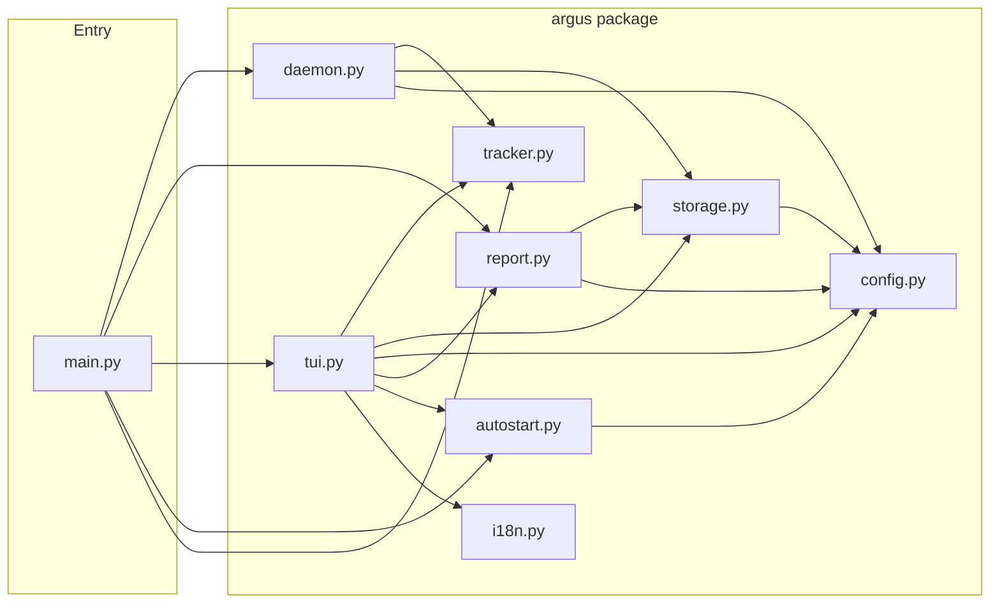
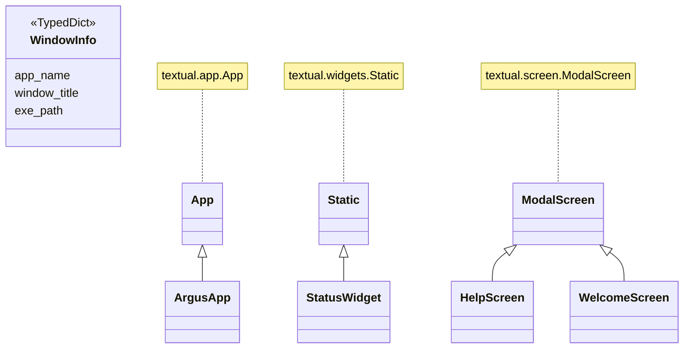
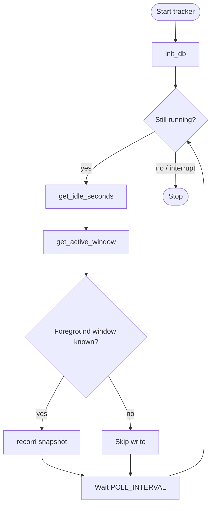
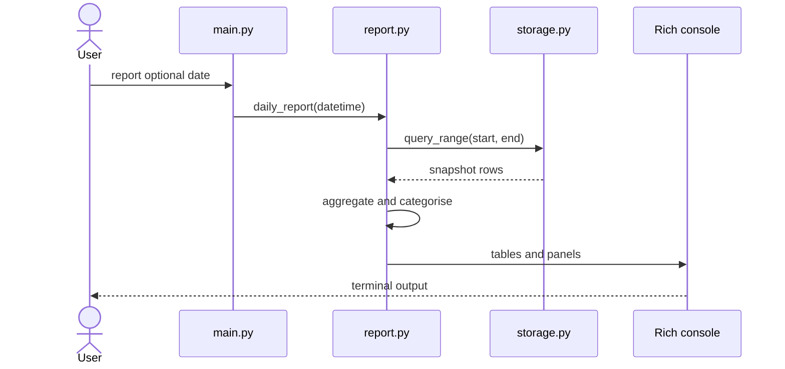

# Argus

**README languages:** English · [日本語](README.ja.md) · [中文](README.zh.md)

> *Named after Argus Panoptes — the hundred-eyed giant of Greek mythology who never slept and watched everything.*

A Python tool that silently records which app and window you have active every 5 seconds. Run it in the background, then pull up a live dashboard or a rich terminal report to see exactly where your time goes.

## Screenshots

Live **TUI** on Windows (`argus tui`): status strip, today’s app and category breakdown with bars, and the weekly table. Left: **Gruvbox**; right: another built-in dark theme (teal palette). Press `T` to cycle themes.


---

## Architecture diagrams

The following [Mermaid](https://mermaid.js.org/) blocks render natively on GitHub. They document the module structure, key types, the tracking polling loop, and the `report` command call sequence.

### Module structure

High-level dependency flow: `main.py` delegates to each `argus/` module.



### Class diagram

`WindowInfo` is the TypedDict snapshot shape returned by the tracker; TUI screens subclass Textual widgets.



### Activity diagram — tracking loop

Shared logic for the `start` / daemon and the TUI background poller: poll interval → idle check → record snapshot → wait → repeat.



### Sequence diagram — `report`



---

## Quickstart

### Windows

```bash
# Download dist/argus.exe and run
argus.exe tui
```

### macOS

```bash
# Download dist/argus and run
./argus tui
```

### Linux

```bash
# Install system dependencies first
sudo apt install xdotool xprintidle   # Ubuntu / Debian
sudo dnf install xdotool xprintidle   # Fedora

# Download dist/argus and run
./argus tui
```

### What to do next

```bash
# View today's activity report
argus tui        # Interactive dashboard (recommended)
argus report     # Text report in terminal

# View specific day
argus report --date 2026-04-05

# View this week's report
argus week

# Check what you're doing right now
argus status

# Auto-start on login
argus install    # Enable auto-start
argus uninstall  # Disable auto-start
```

---

## Keyboard shortcuts (TUI)

| Key | Action |
|---|---|
| `R` | Refresh data immediately |
| `T` | Cycle through colour themes |
| `L` | Cycle through UI languages (6 languages) |
| `A` | Toggle Auto Start |
| `O` | Open the data folder |
| `[` `]` | Previous / next day |
| `{` `}` | Previous / next week |
| `Q` | Quit |

---

## TUI dashboard

`argus tui` opens a live full-terminal dashboard powered by [Textual](https://textual.textualize.io/). It also runs the tracker in the background — no separate `start` command needed.

**What it shows**

- **Status panel** — active app, category, window title, idle time, and total snapshot count
- **Today** — top 10 apps and category breakdown with progress bars
- **This Week** — day-by-day summary table plus weekly top apps and categories

Everything auto-refreshes every 5 seconds.

---

## Languages

The TUI supports 6 languages, cycled with `L`:

`en` (English) · `ja` (日本語) · `zh` (中文) · `fr` (Français) · `de` (Deutsch) · `es` (Español)

Your language choice is saved to `~/.argus/settings.json` and restored on next launch.

---

## Themes

Press `T` in the TUI to cycle through all 12 built-in Textual themes:

`textual-dark` · `textual-light` · `nord` · `gruvbox` · `catppuccin-mocha` · `catppuccin-latte` · `dracula` · `tokyo-night` · `monokai` · `solarized-dark` · `solarized-light` · `flexoki`

Your theme choice is saved and restored automatically.

---

## Data

Everything is stored in `~/.argus/argus.db` (SQLite) by default (override the folder with env `ARGUS_DATA`). One row per 5-second snapshot:

| Column | Type | Description |
|---|---|---|
| `ts` | REAL | Unix timestamp |
| `app_name` | TEXT | Process name (e.g. `chrome`, `code`) |
| `window_title` | TEXT | Window title at that moment |
| `exe_path` | TEXT | Full path to the executable |
| `idle` | INTEGER | 1 if no input for longer than the idle threshold |

Idle snapshots are excluded from all reports and the TUI by default.

User preferences (language, theme) are stored separately in `~/.argus/settings.json`.

---

## Categories

Apps are automatically bucketed into categories:

`Browser` · `IDE / Editor` · `Terminal` · `Communication` · `Design` · `Gaming` · `Productivity` · `Media` · `File Manager` · `System` · `Other`

To add or change mappings, edit the `CATEGORIES` dict in `argus/config.py`.

---

## Stack

| Concern | Tool |
|---|---|
| Active window detection | `pywin32` (Windows) · `osascript` (macOS) · `xdotool` (Linux) |
| Idle detection | `GetLastInputInfo` via ctypes (Windows) · `ioreg` (macOS) · `xprintidle` (Linux) |
| Process info | `psutil` |
| Storage | SQLite via stdlib `sqlite3` |
| CLI | `Typer` |
| Terminal reports | `Rich` |
| Interactive dashboard | `Textual` |
| Auto-start | Registry key (Windows) · LaunchAgent plist (macOS) · XDG autostart (Linux) |

---

## Setup & Building (for experienced users)

> These sections are for developers who want to run from source or build their own executable.

### Setup (development)

```bash
pip install -r requirements.txt
```

**Linux only** — install two extra system packages for window and idle detection:

```bash
sudo apt install xdotool xprintidle   # Ubuntu / Debian
sudo dnf install xdotool xprintidle   # Fedora
```

### Building a standalone executable

Packages Argus into a single file that end users can run with no Python or pip required.

```bash
# Install build tools (one-time)
pip install -r requirements-dev.txt

# Build
python build.py
```

Output lands in `dist/`:

| Platform | File |
|---|---|
| Windows | `dist/argus.exe` |
| Linux | `dist/argus` |
| macOS | `dist/argus` |

The executable is fully self-contained — Python, Textual, Rich, and all other dependencies are bundled inside it. **End users need to install nothing.**

> **Linux note:** `xdotool` and `xprintidle` are system packages that cannot be bundled. Include the following in any Linux distribution:
> ```bash
> sudo apt install xdotool xprintidle
> ```

### Usage (from source)

```bash
# Interactive dashboard (recommended — also runs the tracker in the background)
python src/main.py tui

# Start the tracker alone in the foreground (Ctrl+C to stop)
python src/main.py start

# Today's activity report
python src/main.py report

# Report for a specific day
python src/main.py report --date 2026-03-15

# This week's report
python src/main.py week

# What are you doing right now?
python src/main.py status

# Register Argus to launch automatically at login
python src/main.py install

# Remove from auto-start
python src/main.py uninstall
```

---

## Tuning

Edit the two constants at the top of `argus/config.py`:

```python
POLL_INTERVAL  = 5    # seconds between snapshots
IDLE_THRESHOLD = 60   # seconds of no input before a snapshot is marked idle
```

---

## Project structure

```
src/
├── main.py               # Typer CLI — thin entry point, delegates to argus/
└── argus/
    ├── __init__.py       # package version
    ├── config.py         # constants, category map, settings persistence
    ├── i18n.py           # UI string catalogue (6 languages)
    ├── tracker.py        # active window + idle detection (Win / macOS / Linux)
    ├── storage.py        # SQLite read/write
    ├── daemon.py         # foreground polling loop (used by `start` command)
    ├── report.py         # Rich daily/weekly/status reports
    ├── tui.py            # Textual live dashboard
    └── autostart.py      # login auto-start helpers (Win / macOS / Linux)
build.py                  # PyInstaller build script → dist/argus[.exe]
requirements.txt          # runtime dependencies
requirements-dev.txt      # runtime + build tools (pyinstaller)
dist/                     # compiled executables (git-ignored)
```
