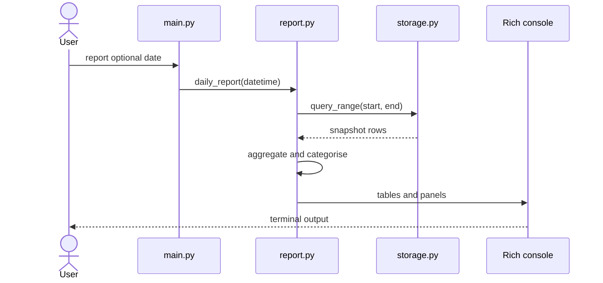
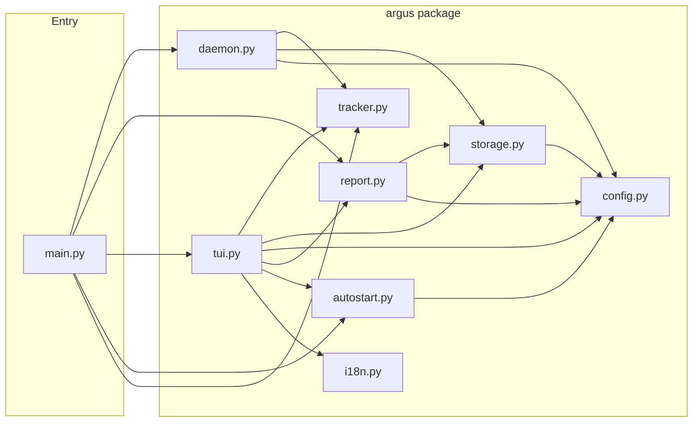
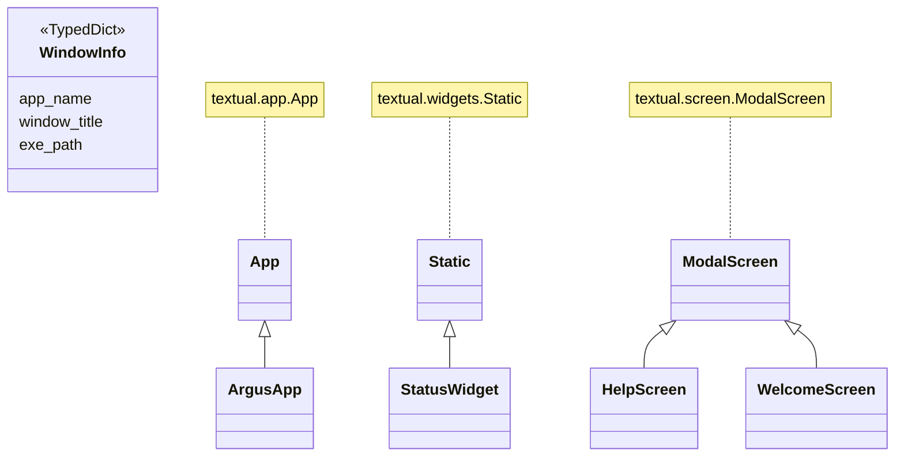
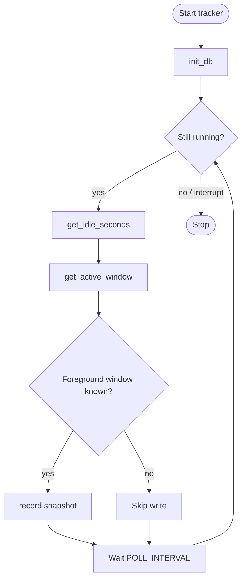

# Argus

|
|**README 语言：** [English](README.md) · [日本語](README.ja.md) · 中文
|
|> *以希腊神话中百眼巨人 Argus Panoptes 命名——他从不安睡，时刻注视着一切。*
|
|> *一个简单的问题，开启了六个月的独立开发之旅：我的时间究竟去了哪里？*
|
|一个 Python 工具，每 5 秒静默记录当前活跃的应用和窗口。在后台运行，随时调出实时仪表盘或终端报告，清楚了解你的时间都去了哪里。

## Screenshots

Screenshots are available in the [English README](README.md#screenshots).

---

## 设计视角

```
需求定义 → 系统基本设计 → 系统详细设计
```

---

### 需求定义

**功能性需求** — 系统做什么。

| # | 需求 | 目标 |
|---|---|---|
| R1 | 追踪前台窗口 | 每 5 秒静默记录 |
| R2 | 自动分类应用 | 11 个内置分类 |
| R3 | 快照存储至 SQLite | 简单、便携、零配置、无需服务器 |
| R4 | 在 TUI 进程内运行追踪器 | 单个 `argus tui` 启动全部，无需独立守护进程 |
| R5 | 登录时自动启动 | 各 OS 注册方式 |
| R6 | 多语言 TUI | 6 种语言，保存至设置 |
| R7 | 12 套配色主题 | 按 `T` 切换 |

**非功能性需求** — 系统做得多好。

| # | 需求 | 目标 |
|---|---|---|
| R8 | 隐私 | 全数据本地存储 — 无网络、无遥测 |
| R9 | 跨平台 | Windows、macOS、Linux |
| R10 | 轻量 | 典型桌面环境下 CPU < 1% |
| R11 | 空闲检测 | 用户离开时跳过快照 |
| R12 | 低存储开销 | 每 5 秒一行 |
| R13 | 模块化 / 可扩展 | 清晰的层次分离 |

> **功能表** — 各需求映射到功能（F1–F7）或质量属性（NF1–NF6）。见底部附录。

---

### 系统基本设计

**三层架构：**

```
┌──────────────────────────────────────────────┐
│  UI 层: TUI (Textual) + 报告 (Rich)          │
├──────────────────────────────────────────────┤
│  服务层: 追踪器、存储、报告                    │
├──────────────────────────────────────────────┤
│  平台层: Win32 / macOS / Linux               │
└──────────────────────────────────────────────┘
```

**项目结构：**

```
src/
├── main.py               # Typer CLI 入口，委托给 argus/
└── argus/
    ├── __init__.py       # 包版本
    ├── config.py         # 常量、分类映射、设置持久化
    ├── i18n.py           # 界面字符串（6 种语言）
    ├── tracker.py        # 活跃窗口 + 空闲检测（Win / macOS / Linux）
    ├── storage.py        # SQLite 读写
    ├── daemon.py         # 前台轮询循环（start 命令）
    ├── report.py         # Rich 日报 / 周报 / 状态报告
    ├── tui.py            # Textual 实时仪表盘
    └── autostart.py      # 开机自启（Win / macOS / Linux）
build.py                  # PyInstaller 构建脚本 → dist/argus[.exe]
requirements.txt          # 运行时依赖
requirements-dev.txt      # 运行时 + 构建工具（pyinstaller）
dist/                     # 编译产物（已加入 .gitignore）
```

**技术栈：**

| Concern | 工具 |
|---|---|
| 活跃窗口检测 | `pywin32`（Windows）· `osascript`（macOS）· `xdotool`（Linux）|
| 空闲检测 | `GetLastInputInfo` via ctypes（Windows）· `ioreg`（macOS）· `xprintidle`（Linux）|
| 进程信息 | `psutil` |
| 存储 | SQLite（标准库 `sqlite3`）|
| CLI | `Typer` |
| 终端报告 | `Rich` |
| 交互式仪表盘 | `Textual` |
| 开机自启 | 注册表键（Windows）· LaunchAgent plist（macOS）· XDG autostart（Linux）|

**应用分类：**

`浏览器` · `IDE / 编辑器` · `终端` · `通讯` · `设计` · `游戏` · `生产力` · `媒体` · `文件管理器` · `系统` · `其他`

修改映射请编辑 `argus/config.py` 中的 `CATEGORIES`。

---

### 系统详细设计

**模块职责：**

| 模块 | 职责 |
|---|---|
| `tracker.py` | 平台级窗口检测 + 空闲检测 |
| `storage.py` | SQLite 初始化、`record()` 写入、`query_range()` 读取 |
| `daemon.py` | 前台轮询循环（`start` 命令） |
| `tui.py` | Textual 仪表盘 + 内嵌后台轮询器 |
| `report.py` | 日报 / 周报 Rich 报告 + 状态面板 |
| `autostart.py` | 各 OS 的开机自启动注册 |
| `config.py` | 常量、分类映射、设置持久化 |
| `i18n.py` | 界面字符串（6 种语言） |

**数据 schema** — `~/.argus/argus.db` 中每 5 秒快照对应一行（目录可用 `ARGUS_DATA` 环境变量修改）：

| 字段 | 类型 | 说明 |
|---|---|---|
| `ts` | REAL | Unix 时间戳 |
| `app_name` | TEXT | 进程名（如 `chrome`、`code`）|
| `window_title` | TEXT | 当时的窗口标题 |
| `exe_path` | TEXT | 可执行文件完整路径 |
| `idle` | INTEGER | 超过空闲阈值时为 1 |

空闲快照在报告和 TUI 中默认排除。用户偏好（语言、主题）单独存储于 `~/.argus/settings.json`。

**调优常量** `argus/config.py` 内：

```python
POLL_INTERVAL  = 5    # 快照间隔（秒）
IDLE_THRESHOLD  = 60   # 标记为空闲的无操作时长（秒）
```

**架构图**（[Mermaid](https://mermaid.js.org/) — GitHub 原生渲染）：

*序列图 — `report` 命令：*



*模块结构：*



*类图 — `WindowInfo` TypedDict 和 TUI 组件层级：*



*活动图 — 追踪循环（`start` 与 TUI 后台轮询器共享）：*



---

## 起源故事

半年前，我遇到了瓶颈。

那时我刚刚结束了——全职工作、兼职项目、自学——一段极度密集的时期。某个晚上，我问了自己一个看似简单的问题：**我的时间究竟去了哪里？**

回忆。试着记录。都行不通。问题不在于努力——而在于看不见。你无法改进你无法衡量的东西，而电脑上的时间是最难事后回顾的。

于是我做了 Argus。

它不是任务管理工具，不是番茄钟。它是一个**被动的、始终运行的镜子**，简单地记录你在做什么——每5秒、无提示、无摩擦——然后让你回头看看真相。

### 为什么要自己造轮子？

我评估过现有工具：RescueTime、ActivityWatch、Toggl。它们都不错，但每个都有我不想要的东西：

- 依赖云服务——我不想把所有窗口活动都发送到服务器
- 订阅费用——对于一个我想永久运行的工具来说
- Linux 支持不足——大多数没有一流的 Linux 支持
- 没有 TUI——我生活在终端里

Argus 是我想要的工具：**本地专用、跨平台、零成本、终端原生。** 它在 Windows、macOS 或 Linux 的后台安静运行。数据永远不会离开你的机器。TUI 仪表盘由 Textual 驱动，实时刷新。周报能揭示你平时注意不到的模式。

### 这半年教会了我什么

在紧张的工作日程中独自开发六个月，教会了我一个意想不到的道理：**约束本身就是特性。** 在清晨和周末的碎片时间里构建 Argus，意味着我无法过度工程化。每一个决定都必须被证明是合理的。简洁成为了哲学，而不仅仅是妥协。

结果是——我每天都在使用这个工具。现在，它开源了。

> 如果你曾经好奇自己的时间去了哪里——[试试看吧](https://github.com/boycececil666/t1-pub-argus)。

---

## Quickstart

### Windows

```bash
# Download dist/argus.exe and run
argus.exe tui
```

### macOS

```bash
# Download dist/argus and run
./argus tui
```

### Linux

```bash
# Install system dependencies first
sudo apt install xdotool xprintidle   # Ubuntu / Debian
sudo dnf install xdotool xprintidle   # Fedora

# Download dist/argus and run
./argus tui
```

### 然后

```bash
# View today's activity report
argus tui        # Interactive dashboard (recommended)
argus report     # Text report in terminal

# View specific day
argus report --date 2026-04-05

# View this week's report
argus week

# Check what you're doing right now
argus status

# Auto-start on login
argus install    # Enable auto-start
argus uninstall  # Disable auto-start
```

---

## Keyboard shortcuts (TUI)

| 按键 | 功能 |
|---|---|
| `R` | 立即刷新所有数据 |
| `T` | 切换颜色主题 |
| `L` | 切换界面语言（6 种语言）|
| `A` | 切换自动启动 |
| `O` | 打开数据文件夹 |
| `[` `]` | 上一天 / 下一天 |
| `{` `}` | 上一周 / 下一周 |
| `Q` | 退出 |

---

## TUI 仪表盘

运行 `argus tui` 打开由 [Textual](https://textual.textualize.io/) 驱动的全终端实时仪表盘，同时在后台运行追踪器，无需单独执行 `start`。

**显示内容**

- **状态面板** — 当前应用、分类、窗口标题、空闲时间、快照总数
- **今日** — 前 10 个应用及分类占比（含进度条）
- **本周** — 逐日汇总、每周分类分布、每周热门应用

每 5 秒自动刷新。

---

## 语言支持

TUI 支持 6 种语言，按 `L` 循环切换：

`en` (English) · `ja` (日本語) · `zh` (中文) · `fr` (Français) · `de` (Deutsch) · `es` (Español)

语言选择保存至 `~/.argus/settings.json`，下次启动时自动恢复。

---

## 主题

在 TUI 中按 `T` 循环切换 12 个内置 Textual 主题：

`textual-dark` · `textual-light` · `nord` · `gruvbox` · `catppuccin-mocha` · `catppuccin-latte` · `dracula` · `tokyo-night` · `monokai` · `solarized-dark` · `solarized-light` · `flexoki`

主题选择同样自动保存并恢复。

---

## Setup & Building

```bash
pip install -r requirements.txt
```

**仅 Linux** — 额外安装两个系统包：

```bash
sudo apt install xdotool xprintidle   # Ubuntu / Debian
sudo dnf install xdotool xprintidle   # Fedora
```

### 构建独立可执行文件

将 Argus 打包为单个文件，终端用户无需安装 Python 或 pip。

```bash
# 安装构建工具（仅需一次）
pip install -r requirements-dev.txt

# 构建
python build.py
```

输出到 `dist/` 目录：

| 平台 | 文件 |
|---|---|
| Windows | `dist/argus.exe` |
| Linux | `dist/argus` |
| macOS | `dist/argus` |

可执行文件完全自包含——Python、Textual、Rich 及所有依赖均已打包。**终端用户无需安装任何额外内容。**

> **Linux 注意：** `xdotool` 和 `xprintidle` 是系统包，无法打包进可执行文件。分发 Linux 版本时请提示用户：
> ```bash
> sudo apt install xdotool xprintidle
> ```

### 使用方法（源码运行）

```bash
# 交互式仪表盘（推荐——同时在后台运行追踪器）
python src/main.py tui

# 仅在前台运行追踪器（Ctrl+C 停止）
python src/main.py start

# 今日活动报告
python src/main.py report

# 指定日期的报告
python src/main.py report --date 2026-03-15

# 本周报告
python src/main.py week

# 查看当前正在做什么
python src/main.py status

# 注册开机自启
python src/main.py install

# 取消开机自启
python src/main.py uninstall
```

---

## 附录 — 功能参考

上面的**需求定义**中的每条需求映射到**功能**（F1–F7）或**质量属性**（NF1–NF6）。

**功能性功能：**

| # | 功能 | 依据 |
|---|---|---|
| F1 | 追踪前台窗口 | 核心价值 — 常驻、静默、后台运行 |
| F2 | 自动分类应用 | 将原始进程名转换为有意义的分类 |
| F3 | 快照存储至 SQLite | 简单、便携、零配置、无需服务器 |
| F4 | 在 TUI 进程内运行追踪器 | 单个 `argus tui` 启动全部，无需独立守护进程 |
| F5 | 登录时自动启动 | 无摩擦 — 无需用户操作即开始记录 |
| F6 | 多语言 TUI（6 种语言） | 非英语用户无障碍使用 |
| F7 | 12 套配色主题 | 无需改代码即可个性化 |

**非功能性质量属性：**

| # | 质量 | 驱动因素 |
|---|---|---|
| NF1 | 隐私 — 全数据本地存储 | 用户信任 |
| NF2 | 跨平台可用性 | 平台多样性 |
| NF3 | 轻量级性能 | 常驻约束 |
| NF4 | 空闲检测 | 数据质量 |
| NF5 | 低存储开销 | 长期可行性 |
| NF6 | 模块化 / 可扩展 | 未来可维护性 |
